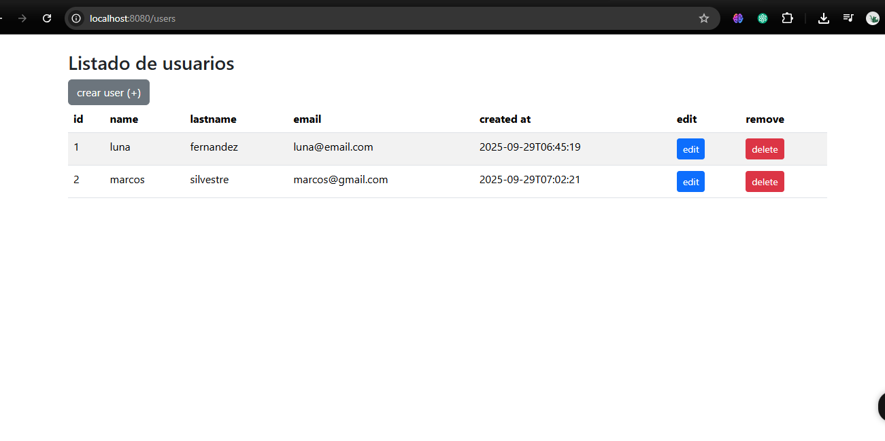
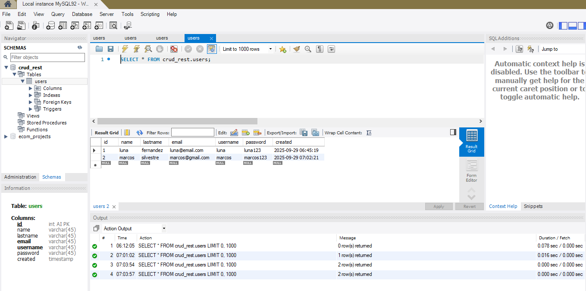
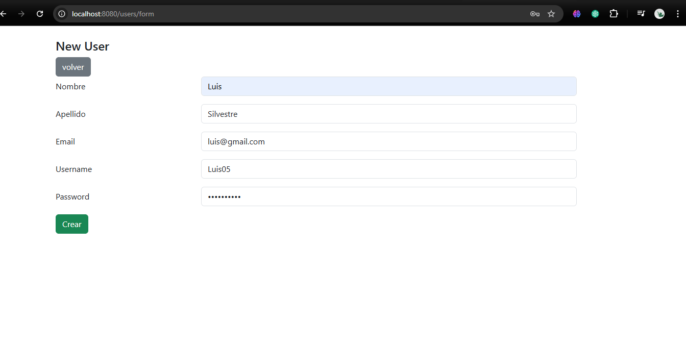
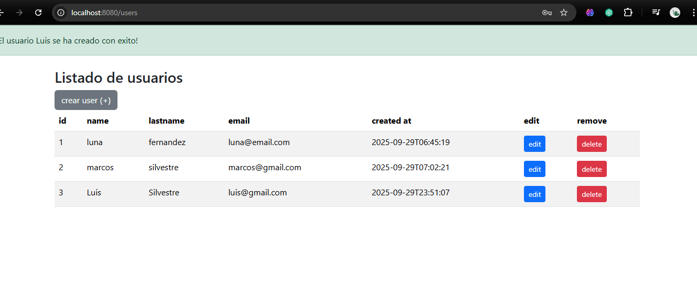
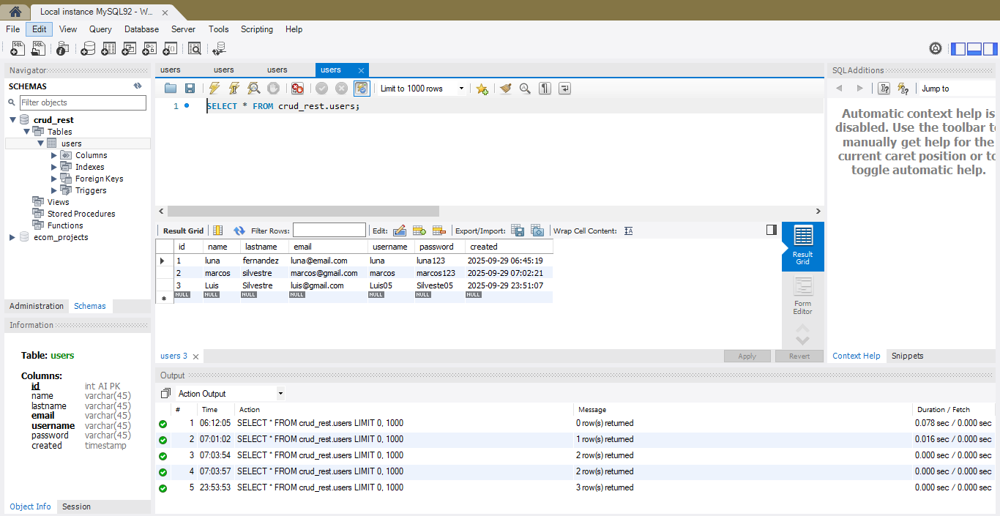
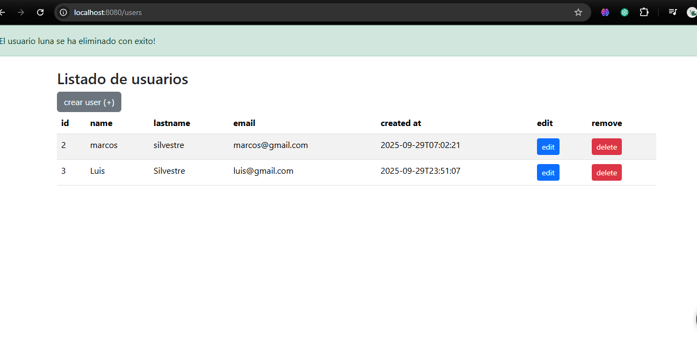
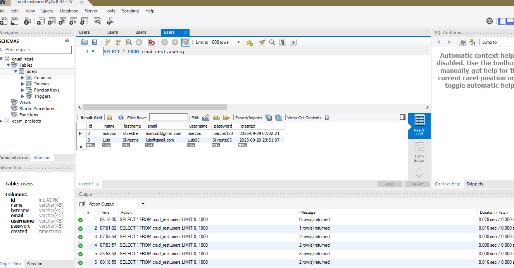

# SpringBoot - CRUD usuarios

Este proyecto es una aplicación web desarrollada con SpringBoot que implementa un sistema básico de gestión de usuarios.  
Permite listar, crear, editar y eliminar usuarios utilizando 'thymeleaf' para las vistas, 'Spring Data JPA' para la persistencia y 'MySQL' como base de datos.

#Tecnologías Utilizadas:

-Java 21

-SpringBoot

-Spring Data JPA

-Thymeleaf

-Base de datos(MySQL)

-Maven

-Boostrap

#Estructura del Proyecto: 

* src/main/java/org.ismael.web

. controllers -> Controlador MVC(Modelo-Vista-Controlador)
. entity -> Entidades JPA
. repository -> Repositorio JPA
. services -> Lógica de negocio

*src/main/resources
. templates -> vistas thymeleaf(list.html, form.html, view.html)

#Como ejecutar localmente:

1. Clona el repositorio: git clone https://github.com/LuisJS05/backecom.git

2. Ingresa el directorio: cd springboot

3. Buil y run con Maven:
   
   . mvn clean install
   
   . mvn spring-boot:run

5. El servidor arrancara en: http://localhost:8080/users

#Configurar la Base de datos MySQL:

El nombre de base de datos en MySQL debe ser igual donde esta en application.properties,
ademas el usuario y contraseña deben coincidir con tu base de datos(MySQL)

* src/main/resources/application.resources
  Ejemplo:
  spring.datasource.url=jdbc:mysql://localhost:3306/usersdb
  spring.datasource.username=tuUsuario
  spring.datasource.password=tuContraseña
  spring.jpa.hibernate.ddl-auto=update

#Ejecutar la aplicación

#Abrir en el navegador:

   http://localhost:8080/users

#Muestra de lista de usuarios

#Imagen de creación de usuario

#Imagen de nuevo usuario en página

#Imagen de usuario creado en Base de Datos

#Imagen de eliminar usuario *Luna* en página

#Imagen de eliminación de usario en base de datos

